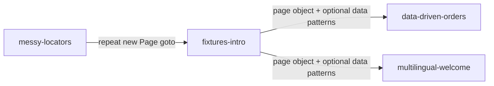

# Fixtures intro (DRY demo)

A minimal Playwright example whose **only job** is to teach **custom fixtures**:
what they are, why they help DRY, and how they relate to the repetitive setup in
[messy-locators](../messy-locators/).

The app is a **team standup board** behind a mock sign-in page — clean, accessible
markup, no real auth backend. The lesson is setup and injection, not finding elements.

## Run it

Uses **Google Chrome** on your machine (`channel: 'chrome'`).

```bash
# first time only
#   PowerShell:  $env:PLAYWRIGHT_SKIP_BROWSER_DOWNLOAD=1; npm install
#   bash/zsh:    PLAYWRIGHT_SKIP_BROWSER_DOWNLOAD=1 npm install
npm install

npm test
npm run test:headed
npm run test:ui
npm run report
```

If Chrome is not installed, change `channel: 'chrome'` to `channel: 'msedge'` in
`playwright.config.ts`.

## What is a fixture?

When you write:

```typescript
test('my test', async ({ page }) => { ... });
```

Playwright **creates** a browser page, **passes it in**, and **cleans up** after the
test. You never wrote `browser.newPage()` — that is a **built-in fixture**.

A **custom fixture** adds more injectables the same way:

```typescript
test('my test', async ({ loginPage }) => { ... });
test('board test', async ({ standupPage }) => { ... });
```

You register fixtures once in [`fixtures/standupTest.ts`](fixtures/standupTest.ts).
Playwright builds them before each test and hands them to you.

## Before vs after (DRY)

### Before — [messy-locators](../messy-locators/) pattern

Every test repeats construction and navigation:

```typescript
import { test, expect } from '@playwright/test';
import { InvoicePortalPage } from '../pages/invoice-portal.page.js';

test('search narrows visible rows', async ({ page }) => {
  const portal = new InvoicePortalPage(page);
  await portal.goto();
  // ... test steps
});

test('assigns a unique vendor row', async ({ page }) => {
  const portal = new InvoicePortalPage(page);
  await portal.goto();
  // ... same two lines again
});
```

Change how you open the app? Edit **every test**.

### After — this project (simple fixture)

Shared setup for the login page lives in the fixture:

```typescript
// fixtures/standupTest.ts
export const test = base.extend({
  loginPage: async ({ page }, use) => {
    const loginPage = new LoginPage(page);
    await loginPage.goto();
    await use(loginPage);
  }
});
```

Specs import **your** `test` and ask for the fixture:

```typescript
import { test, expect } from '../fixtures/standupTest.js';

test('shows the login form', async ({ loginPage }) => {
  await expect(loginPage.heading).toBeVisible();
});
```

No `new LoginPage(page)`. No `goto()`. One place to change setup.

## How Playwright "knows" about your fixture

There is **no auto-scan** of a `fixtures/` folder. The spec imports your extended
`test`:

```typescript
import { test, expect } from '../fixtures/standupTest.js';
//     ^^^^ not from '@playwright/test'
```

Parameter names in `async ({ standupPage })` must match what you registered in
`test.extend({ standupPage: ... })`.

## When to use a fixture

| Good fit | Poor fit |
| --- | --- |
| Constructing a page object | Plain data from a CSV row (use a loop + closure) |
| Shared login / `goto()` | One-off values already in the test |
| API clients, DB helpers | Things with no setup/teardown |

See [multilingual-welcome](../multilingual-welcome/) for the split: **fixture for
`welcomePage`**, **closure for culture data**.

## When a fixture depends on another fixture

The simple `loginPage` fixture removes repeated construction and navigation to the
sign-in screen. The **real value** shows up with `standupPage`: the standup board
is **gated behind login**, so `StandupPage` logically depends on `LoginPage` — you
cannot use one without the other.

### Before — repeat login in every standup test

Without a dependent fixture, each board test repeats the same login chain:

```typescript
test('loads with three open tasks', async ({ page }) => {
  const loginPage = new LoginPage(page);
  await loginPage.goto();
  await loginPage.login('demo', 'demo');
  const standupPage = new StandupPage(page);
  // ... finally the assertion
});

test('marks the first task done', async ({ page }) => {
  const loginPage = new LoginPage(page);
  await loginPage.goto();
  await loginPage.login('demo', 'demo');
  const standupPage = new StandupPage(page);
  // ... same four lines again
});
```

### After — dependent fixture chains off the simple one

Playwright builds fixtures in dependency order: `page` → `loginPage` →
`standupPage`. The complex fixture never calls `goto()` itself — it inherits the
login page from `loginPage`, then performs mock sign-in:

```typescript
// fixtures/standupTest.ts
standupPage: async ({ loginPage }, use) => {
  await loginPage.login();
  await use(new StandupPage(loginPage.page));
},
```

Tests for the board ask for the authenticated page object and start at the
interesting state:

```typescript
test('loads with three open tasks', async ({ standupPage }) => {
  await expect(standupPage.taskItems()).toHaveCount(3);
});
```

| Fixture | What it DRYs up |
| --- | --- |
| `loginPage` | `new LoginPage(page)` + `goto('login.html')` |
| `standupPage` | Mock login workflow + `StandupPage` construction |

**Why this dependency is real:** visiting `index.html` without signing in redirects
back to `login.html`. There is no standup board to test until `LoginPage.login()`
runs — not just a preference, an app gate.

## Project layout

| Path | Purpose |
| --- | --- |
| `login.html`, `login.js` | Mock sign-in page |
| `index.html`, `app.js` | Standup board (auth-gated) |
| `pages/login.page.ts` | Login page object |
| `pages/standup.page.ts` | Standup board page object |
| `pages/standup-task-list.page.ts` | Nested component page object (task list region) |
| `fixtures/standupTest.ts` | Custom `test` with `loginPage` and `standupPage` fixtures |
| `tests/login.spec.ts` | Simple tests — `{ loginPage }` |
| `tests/standup.spec.ts` | Dependent-fixture tests — `{ standupPage }` |

## Teaching arc in this repo



1. **messy-locators** — ugly markup; repeat `new InvoicePortalPage(page)` + `goto()`
2. **fixtures-intro** (here) — move that boilerplate into a fixture
3. **data-driven-orders / multilingual-welcome** — add external data; fixture for page object only

## Talking points

1. **`page` is already a fixture** — custom fixtures follow the same idea.
2. **DRY** — construction + navigation in one file, not copied into every test.
3. **Import your extended `test`** — that wires everything up.
4. **Fixtures build things** — data rows from a loop are a different pattern (see
   multilingual-welcome README).
5. **Dependent fixtures** — chain off a simpler fixture to DRY workflows like login;
   `StandupPage` depends on `LoginPage` because the app requires sign-in first.
