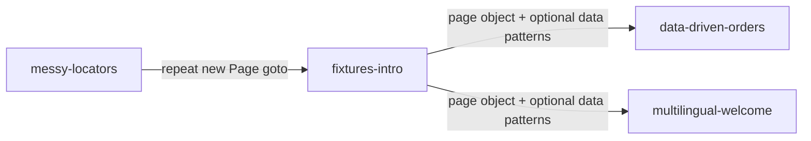

# Fixtures intro (DRY demo)

A minimal Playwright example whose **only job** is to teach **custom fixtures**:
what they are, why they help DRY, and how they relate to the repetitive setup in
[messy-locators](../messy-locators/).

The app is a simple **team standup board** with clean, accessible markup — no
locator tricks. The lesson is setup and injection, not finding elements.

## Run it

Uses **Google Chrome** on your machine (`channel: 'chrome'`).

```bash
# first time only
#   PowerShell:  $env:PLAYWRIGHT_SKIP_BROWSER_DOWNLOAD=1; npm install
#   bash/zsh:    PLAYWRIGHT_SKIP_BROWSER_DOWNLOAD=1 npm install
npm install

npm test
npm run test:headed
npm run test:ui
npm run report
```

If Chrome is not installed, change `channel: 'chrome'` to `channel: 'msedge'` in
`playwright.config.ts`.

## What is a fixture?

When you write:

```typescript
test('my test', async ({ page }) => { ... });
```

Playwright **creates** a browser page, **passes it in**, and **cleans up** after the
test. You never wrote `browser.newPage()` — that is a **built-in fixture**.

A **custom fixture** adds more injectables the same way:

```typescript
test('my test', async ({ standupPage }) => { ... });
```

You register `standupPage` once in [`fixtures/standupTest.ts`](fixtures/standupTest.ts).
Playwright builds it before each test and hands it to you.

## Before vs after (DRY)

### Before — [messy-locators](../messy-locators/) pattern

Every test repeats construction and navigation:

```typescript
import { test, expect } from '@playwright/test';
import { InvoicePortalPage } from '../pages/invoice-portal.page.js';

test('search narrows visible rows', async ({ page }) => {
  const portal = new InvoicePortalPage(page);
  await portal.goto();
  // ... test steps
});

test('assigns a unique vendor row', async ({ page }) => {
  const portal = new InvoicePortalPage(page);
  await portal.goto();
  // ... same two lines again
});
```

Change how you open the app? Edit **every test**.

### After — this project

Shared setup lives in the fixture:

```typescript
// fixtures/standupTest.ts
export const test = base.extend({
  standupPage: async ({ page }, use) => {
    const standupPage = new StandupPage(page);
    await standupPage.goto();
    await use(standupPage);
  }
});
```

Specs import **your** `test` and ask for the fixture:

```typescript
import { test, expect } from '../fixtures/standupTest.js';

test('loads with three open tasks', async ({ standupPage }) => {
  await expect(standupPage.taskItems()).toHaveCount(3);
});
```

No `new StandupPage(page)`. No `goto()`. One place to change setup.

## How Playwright "knows" about your fixture

There is **no auto-scan** of a `fixtures/` folder. The spec imports your extended
`test`:

```typescript
import { test, expect } from '../fixtures/standupTest.js';
//     ^^^^ not from '@playwright/test'
```

Parameter names in `async ({ standupPage })` must match what you registered in
`test.extend({ standupPage: ... })`.

## When to use a fixture

| Good fit | Poor fit |
| --- | --- |
| Constructing a page object | Plain data from a CSV row (use a loop + closure) |
| Shared login / `goto()` | One-off values already in the test |
| API clients, DB helpers | Things with no setup/teardown |

See [multilingual-welcome](../multilingual-welcome/) for the split: **fixture for
`welcomePage`**, **closure for culture data**.

## Project layout

| Path | Purpose |
| --- | --- |
| `index.html`, `app.js` | Simple standup board |
| `pages/standup.page.ts` | Page object |
| `fixtures/standupTest.ts` | Custom `test` with `standupPage` fixture |
| `tests/standup.spec.ts` | Three tests — `{ standupPage }` only |

## Teaching arc in this repo



1. **messy-locators** — ugly markup; repeat `new InvoicePortalPage(page)` + `goto()`
2. **fixtures-intro** (here) — move that boilerplate into a fixture
3. **data-driven-orders / multilingual-welcome** — add external data; fixture for page object only

## Talking points

1. **`page` is already a fixture** — custom fixtures follow the same idea.
2. **DRY** — construction + navigation in one file, not copied into every test.
3. **Import your extended `test`** — that wires everything up.
4. **Fixtures build things** — data rows from a loop are a different pattern (see
   multilingual-welcome README).
