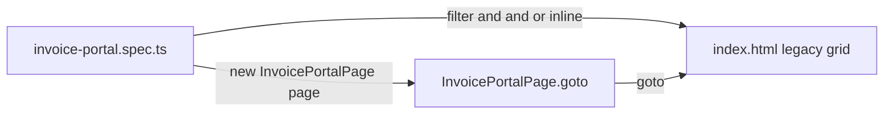

# Messy locators (no data-testids)

A self-contained Playwright example for **real-world markup you cannot control**:
hashed CSS classes, div soup, duplicate labels, missing accessibility — and **no
`data-testid` hooks**.

The mock app is a legacy third-party **invoice queue** widget. Three tests in the
spec file each demonstrate one locator API — `filter()`, `.and()`, and `.or()` —
with inline comments you can walk through in class.

A separate **fixtures intro** demo (coming later) will move locators into the page
object and inject it automatically. Here, every test starts with
`new InvoicePortalPage(page)` only for `goto()`.

## Run it

Uses **Google Chrome** on your machine (`channel: 'chrome'`).

```bash
# first time only
#   PowerShell:  $env:PLAYWRIGHT_SKIP_BROWSER_DOWNLOAD=1; npm install
#   bash/zsh:    PLAYWRIGHT_SKIP_BROWSER_DOWNLOAD=1 npm install
npm install

npm test
npm run test:headed
npm run test:ui
npm run report
```

If Chrome is not installed, change `channel: 'chrome'` to `channel: 'msedge'` in
`playwright.config.ts`.

## What makes this markup "messy"

| Problem | What devs did | How we locate |
| --- | --- | --- |
| No test ids | Nothing | Role, text, filter — not `getByTestId` |
| Hashed classes | `legacy_tbl__x7f2` | Ignore classes when possible |
| Div soup grid | `role="table"` / `role="row"` | `getByRole('row')` + filter |
| Duplicate vendor | Two **Acme Corp** rows | `filter({ hasText })` chained or `.and()` |
| Identical buttons | Every row has **Assign** | Scope: `row.getByRole('button', { name: 'Assign' })` |
| Mixed controls | Contoso uses a link, others use buttons | `.or()` for button vs link |
| Icon-only delete | `×` with no aria-label | Scope to row + `.last()` button — fragile, documented |

## Three tests, three APIs

| Test | API | Scenario |
| --- | --- | --- |
| `filter() picks one row when vendor name is duplicated` | `.filter({ hasText })` | Two **Acme Corp** rows → filter by vendor + amount |
| `.and() requires every condition on the same element` | `.and(otherLocator)` | Same Acme row, intersection syntax instead of chained filters |
| `.or() handles mixed control types in legacy markup` | `.or(otherLocator)` | Contoso link **Assign invoice** vs button **Assign** |

## Strict mode

`getByText('Acme Corp')` at page level may match multiple rows and **throw**. Narrow
with `.filter()` until exactly one element matches, or use `.nth(0)` when you mean
the first match.

## Project layout

| Path | Purpose |
| --- | --- |
| `index.html`, `app.js` | Legacy invoice grid (intentionally bad markup) |
| `pages/invoice-portal.page.ts` | `goto()` only — locators live in the spec for now |
| `tests/invoice-portal.spec.ts` | Three teaching tests with inline locators and comments |

## Spec pattern (no fixture)

```typescript
import { test, expect } from '@playwright/test';
import { InvoicePortalPage } from '../pages/invoice-portal.page.js';

test('filter() picks one row when vendor name is duplicated', async ({ page }) => {
  const portal = new InvoicePortalPage(page);
  await portal.goto();

  const dataRows = page.getByRole('row').filter({
    has: page.getByRole('button', { name: 'Assign' }),
  });

  const acme415 = dataRows
    .filter({ hasText: 'Acme Corp' })
    .filter({ hasText: '$415.50' });

  await expect(acme415).toHaveCount(1);
  await acme415.getByRole('button', { name: 'Assign' }).click();
  await expect(acme415.getByText('Assigned', { exact: true })).toBeVisible();
});
```

## Talking points

1. **Clean vs messy** — BulkBox lab has a "clean zone" (test ids) and a "messy zone"
   (third-party grid). This demo is all messy zone.
2. **Read locators in the spec first** — three focused tests with comments; no
   hidden helpers.
3. **Page object + fixtures (next demo)** — move locators into `InvoicePortalPage`
   and inject it so you drop `new InvoicePortalPage(page)` from every test.
4. **Ask devs for better a11y** — but ship tests anyway with the strategies above.

## Data flow


