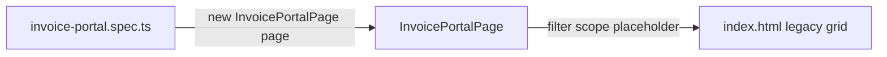

# Messy locators (no data-testids)

A self-contained Playwright example for **real-world markup you cannot control**:
hashed CSS classes, div soup, duplicate labels, missing accessibility — and **no
`data-testid` hooks**.

The mock app is a legacy third-party **invoice queue** widget. Tests use role,
text, `filter()`, and scoping — strategies centralized in a page object.

A separate **fixtures intro** demo (coming later) will show how to inject the page
object automatically. Here, every test starts with `new InvoicePortalPage(page)` on
purpose so you feel that repetition.

## Run it

Uses **Google Chrome** on your machine (`channel: 'chrome'`).

```bash
# first time only
#   PowerShell:  $env:PLAYWRIGHT_SKIP_BROWSER_DOWNLOAD=1; npm install
#   bash/zsh:    PLAYWRIGHT_SKIP_BROWSER_DOWNLOAD=1 npm install
npm install

npm test
npm run test:headed
npm run test:ui
npm run report
```

If Chrome is not installed, change `channel: 'chrome'` to `channel: 'msedge'` in
`playwright.config.ts`.

## What makes this markup "messy"

| Problem | What devs did | How we locate |
| --- | --- | --- |
| No test ids | Nothing | Role, text, filter — not `getByTestId` |
| Hashed classes | `legacy_tbl__x7f2` | Ignore classes when possible |
| Div soup grid | `role="table"` / `role="row"` | `getByRole('row')` + filter |
| Duplicate vendor | Two **Acme Corp** rows | `filter({ hasText: vendor }).filter({ hasText: amount })` |
| Identical buttons | Every row has **Assign** | Scope: `row.getByRole('button', { name: 'Assign' })` |
| Bad search field | Placeholder only, no label | `getByPlaceholder()` (last resort) |
| Icon-only delete | `×` with no aria-label | Scope to row + `.last()` button — fragile, documented |

## Locator strategies (in order of preference)

1. **Role + name** — `getByRole('button', { name: 'Assign' })` when scoped to a row
2. **filter()** — narrow `getByRole('row')` by visible text
3. **Chained filters** — duplicate vendors: filter by name, then by amount
4. **`.and()`** — alternative to chaining two filters (see page object)
5. **Placeholder** — when there is no label at all
6. **CSS / nth / last()** — escape hatches when a11y is missing (delete button)

## Strict mode

`getByText('Acme Corp')` at page level may match multiple rows and **throw**. Narrow
with `.filter()` until exactly one element matches, or use `.nth(0)` when you mean
the first match.

## Project layout

| Path | Purpose |
| --- | --- |
| `index.html`, `app.js` | Legacy invoice grid (intentionally bad markup) |
| `pages/invoice-portal.page.ts` | Messy locator strategies — write once |
| `tests/invoice-portal.spec.ts` | Four tests; standard `@playwright/test` import |

## Spec pattern (no fixture)

```typescript
import { test, expect } from '@playwright/test';
import { InvoicePortalPage } from '../pages/invoice-portal.page.js';

test('assigns a unique vendor row', async ({ page }) => {
  const portal = new InvoicePortalPage(page);
  await portal.goto();

  const row = portal.rowByVendor('Northwind Traders');
  await portal.assignButtonForRow(row).click();
  await expect(portal.statusInRow(row, 'Assigned')).toBeVisible();
});
```

## Talking points

1. **Clean vs messy** — BulkBox lab has a "clean zone" (test ids) and a "messy zone"
   (third-party grid). This demo is all messy zone.
2. **Page object** — ugly locators live in one file; specs read like test steps.
3. **Fixtures (next demo)** — inject `InvoicePortalPage` so you drop
   `new InvoicePortalPage(page)` and `goto()` from every test.
4. **Ask devs for better a11y** — but ship tests anyway with the strategies above.

## Data flow


