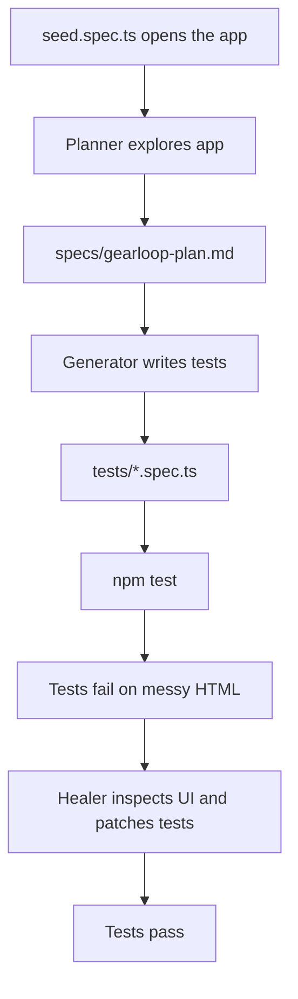

# Playwright Agents demo (Planner → Generator → Healer)

A self-contained demo for **Playwright's built-in Test Agents** (new in
Playwright 1.56). The mock app — **GearLoop**, an internal equipment-checkout
tool — is intentionally built the way real product teams build UIs: no
`data-testid` hooks, a few accessibility gaps, and some genuinely ambiguous
markup. That is on purpose. It gives the **Healer** agent real work to do.

> New to the VS Code side of this? Read **[SETUP.md](SETUP.md)** first — it walks
> you through everything you need to install (and answers "do I need to pay for
> Copilot?" — short answer: no).

## The three agents

| Agent | Job | Input | Output |
| --- | --- | --- | --- |
| Planner | Explore the app, write a test plan | seed test + `PRD.md` | `specs/*.md` |
| Generator | Turn the plan into real tests | `specs/*.md` | `tests/*.spec.ts` |
| Healer | Run failing tests and repair them | failing test | patched, passing test |



## What ships in this folder (and what does not)

Shipped:

| Path | Purpose |
| --- | --- |
| `index.html`, `catalog.html`, `styles.css`, `app.js` | The GearLoop mock app |
| `tests/seed.spec.ts` | The only hand-written test — bootstraps the agents |
| `PRD.md` | Product brief you attach to the Planner |
| `SETUP.md` | Step-by-step VS Code setup |
| `specs/` | Empty — the Planner fills it in live |

**Not** shipped (you generate these yourself so the class sees it happen):

- `.github/` agent definitions and `.vscode/mcp.json` — created by
  `npx playwright init-agents --loop=vscode`
- Any `specs/*.md` plan — created by the Planner
- Any generated `tests/*.spec.ts` — created by the Generator

## Run it (plain Playwright, no agents)

Uses **Google Chrome** already on your machine (`channel: 'chrome'`) — no browser
download.

```bash
# first time only — the env var skips the ~400MB browser download
#   PowerShell:  $env:PLAYWRIGHT_SKIP_BROWSER_DOWNLOAD=1; npm install
#   bash/zsh:    PLAYWRIGHT_SKIP_BROWSER_DOWNLOAD=1 npm install
npm install

npx playwright test tests/seed.spec.ts   # should pass — proves the app loads
npm run test:headed                       # watch it in a real browser
npm run report
```

If Chrome is not installed, change `channel: 'chrome'` to `channel: 'msedge'` in
`playwright.config.ts`.

## The demo, step by step

### 0. One-time setup

Follow **[SETUP.md](SETUP.md)**, then from this folder:

```bash
npx playwright init-agents --loop=vscode
```

Reload VS Code. You should now see `playwright-test-planner`,
`playwright-test-generator`, and `playwright-test-healer` in the Copilot Chat
agent dropdown.

### 1. Planner — "what should we test?"

Open Copilot Chat, pick **playwright-test-planner**, attach `tests/seed.spec.ts`
and `PRD.md`, and prompt:

> Explore GearLoop and write a test plan covering sign-in, sign-in validation,
> searching for equipment, and checking out an item. Save it to `specs/`.

Output: a human-readable `specs/gearloop-plan.md`. No code yet.

### 2. Generator — "write the tests"

Switch to **playwright-test-generator**, attach the new `specs/*.md` and the seed
test, and prompt:

> Generate Playwright tests from the plan. Reference `tests/seed.spec.ts`.

Output: `tests/*.spec.ts` with real locators and assertions.

### 3. Run the tests — watch them fail (the teaching moment)

```bash
npm test
```

The messy markup makes naive locators fail. This is expected and is the whole
point. Tie each failure back to the HTML:

| What the Generator likely wrote | Why it fails | Where in the HTML |
| --- | --- | --- |
| `getByRole('button', { name: 'Enter portal' })` | The sign-in CTA is a `<div role="link">`, not a button → **timeout / not found** | `index.html` `.gate-action` |
| `getByRole('button', { name: 'Check out' })` (page level) | Five cards share that exact label → **strict mode violation (5 elements)** | `catalog.html` `.btn-primary` |
| `getByText('Dell Monitor')` | Two cards use that name → matches 2 elements | the two `Dell Monitor` cards |

(Verified: those first two locators fail exactly as described.)

### 4. Healer — "find the broken tests and fix them"

Switch to **playwright-test-healer** and prompt:

> Fix the failing tests in `tests/`.

The Healer replays the failing test, inspects the live DOM, proposes a patch,
and re-runs until green (or marks a test `fixme` if it thinks the app is
actually broken). Expect fixes like:

- Sign-in CTA → `getByText('Enter portal')` or a scoped `.gate-action` locator
  instead of `getByRole('button', …)`.
- Check out → scope to one card first, then the button inside it:

```ts
const projector = page.locator('.equip-card').filter({ hasText: 'Epson Projector' });
await projector.getByRole('button', { name: 'Check out' }).click();
await expect(projector.getByText('Checked out')).toBeVisible();
```

**Review the diff before accepting.** Good heals scope the locator; watch for bad
heals that weaken an assertion just to make it pass.

Re-run to confirm green:

```bash
npm test
```

## Talking points for the class

1. The Healer edits **test code** (locators, waits, assertions), not your app.
2. You **point** the Healer at failures — it does not scan the repo on its own.
3. Agents **do not replace** `playwright test`; your runner still executes tests.
4. Regenerate agent definitions (`init-agents`) whenever you upgrade Playwright.

## If everything passes on the first Generator run

Sometimes the Generator gets lucky. To force a Healer moment, hand-break one
locator in a generated test (e.g. change `'Check out'` to `'Checkout'`), run
`npm test`, then ask the Healer to fix that file.
